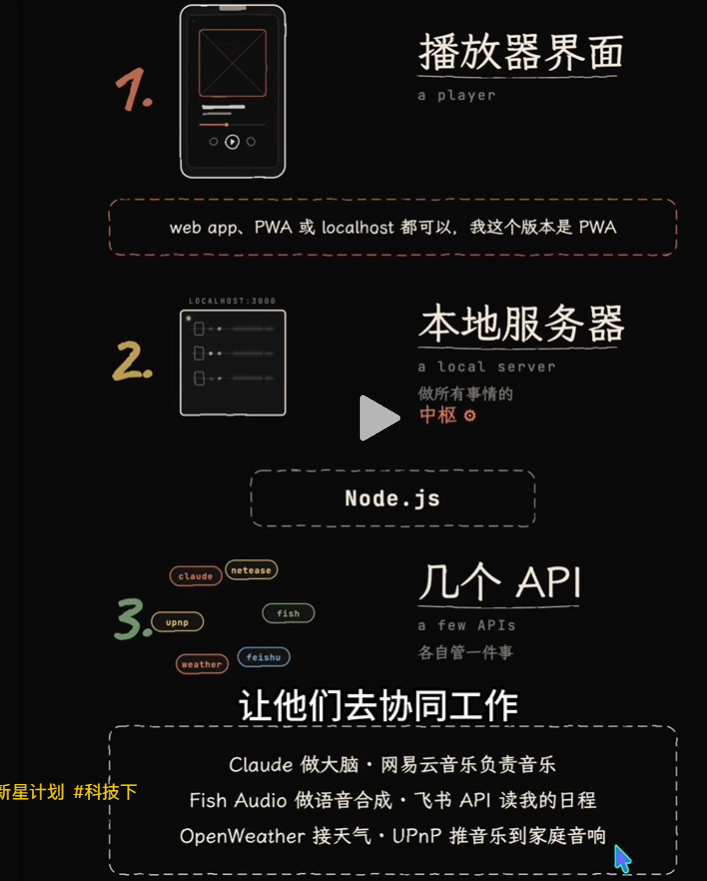
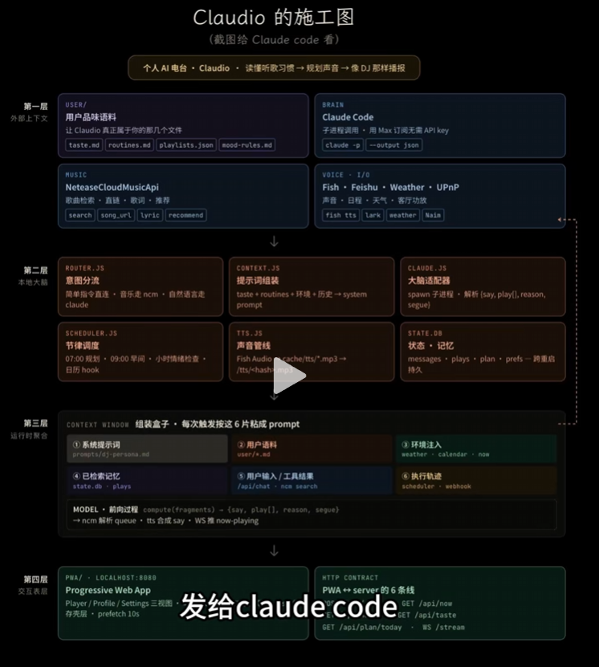
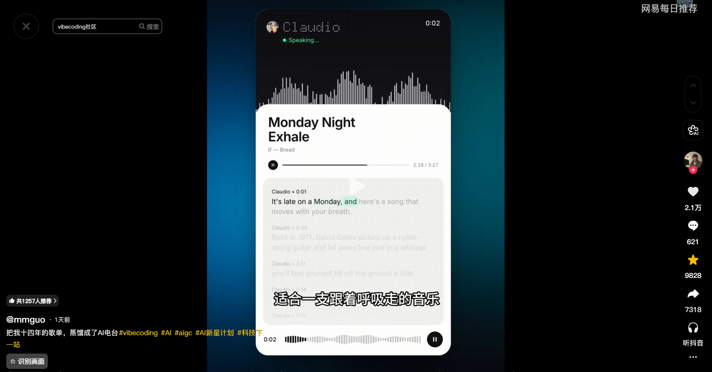

# Emily

Emily 是供单个主人跨设备使用的个人 Web / PWA 电台。目标是在独立的 unbow 子域名上登录、连接本人的网易云账号，收听由模型编排的音乐与英文女声串场。项目与个人主站无关，不是公共多人音乐平台。

**当前状态：2026-09-30 Pi 已部署 RN 独立 HTTPS 网站；本人网易授权、真实歌曲与浏览器连续播放已验证；David已取消锁屏/小米专项验收门槛，当前按mm参考重做UI/UX。**

- 接续方：David 指定的电脑端 Pi Agent。
- Pi 当前分支：`pi/emily-continue-20260930`，源自 `iris/emily-v1-english-20260930` 的 `c7af2c2`；不要把仍停留在旧基线的 `main` 当成最新实现。
- 先读 [Pi 交接说明](docs/handoff-to-pi-20260930.md)。
- 当前执行状态以 [开发入口](docs/development.md) 为准；接口以 [API 契约](docs/api-contract.md) 和 `packages/shared/src/index.ts` 为准。
- 原交接两项失败回归已修复，保留断言并新增播放/声线/关闭边界测试；当前前后端56项、真实浏览器fixture联合检查1项、离线部署预检及私有桥接7项，共64项通过。不得因为测试和构建通过而宣称真实账号或产品完整可用。

## 已有实现

- React / Vite 移动优先界面：个人登录、网易云扫码连接入口、节目选择、播放器、历史、设置、安静模式和沉浸模式。
- 单个真实 HTML 音频元素：主持 → 歌曲 → 队列推进，实际进度、跳转、音量和 Media Session。生产界面没有示例歌单或假播放进度。
- Fastify 后端：单主人会话、输入校验、SQLite 持久化、加密的网易云授权、歌曲解析、模型编排和受保护的音频路由。
- 英文女声 Edge TTS：参数数组调用、声线校验、缓存和超时。默认声线为 `en-US-EmmaMultilingualNeural`，不是永久选择。
- 模型可写简短自然英文主持词；曲目 ID 必须来自实际候选目录。未配置或调用失败时明确回退真实歌单，不假装 AI 或外部服务已经成功。
- PWA 图标、manifest 和静态外壳缓存；不缓存私有 API、二维码、凭据或音乐。

源码已存在；旧的「仓库仅有三张截图」说明不再代表当前状态。

## 验证范围

Pi 本机的构建、类型检查、自动测试、真实 TTS 与浏览器检查见 [当前开发记录](docs/development.md)；[Iris 交接测试记录](docs/handoff-to-pi-20260930.md#验证结果)保留为历史证据。自动测试使用明确标记的 HTTP / 音频 fixture，不能证明本人的网易云会员播放、实际模型通道或小米锁屏行为。

已完成真实桌面 Chrome 登录/导航/缺配置界面、393px视口与真实 Edge 语音解码播放检查；项目内 `npm run test:browser` 已覆盖主持→歌曲→下一首、暂停/seek/安静模式及PWA离线外壳（明确测试音源）；已完成本人网易扫码、真实Gemini节目编排、2首实际歌曲/CDN完整数据、主持→歌曲→下一段主持→第二首及暂停/seek/安静模式/退出验证；另一次安静模式自然播放完200.587秒歌曲并自动续播。不是全目录会员证明。物理锁屏/后台未测试，David明确不要求该项作为交付门槛；当前优先级是实际UI/UX重做。

部署方式与最少配置输入见 [上线准备](docs/deployment.md)；新增专用systemd/反代待审核模板及 `npm run test:deployment` 离线只读预检。RN专用应用/适配器服务与独立HTTPS已部署，Cloudflare仅新增Emily DNS-only记录。模型采用Emily专用OAPI令牌与实际验证的gemini-3.8-flash；不共享代理密钥。当前Node/SQLite/TTS后端不能只上传静态Pages就声称上线。

## 本地运行

Pi 当前 Windows 验证环境为 Node 24.16.0、npm 11.17.0；Iris 历史 Linux 环境为 Node 26.7.0。SQLite 使用 `node:sqlite`，前端测试使用 Node TypeScript stripping。电脑端应先确认现有 Node、npm、uvx、ffmpeg/ffprobe 和本地项目规则，再运行命令；不能把 Linux 验证当成 Windows 已验证。

在仓库根目录执行：

```sh
npm ci
npm run typecheck
npm run build
npm run test --workspace @emily/web
npm run typecheck:tests --workspace @emily/server
npm test --workspace @emily/server
npm run test:built --workspace @emily/server
```

原失败测试已保留并修复；后端27项、前端27项和浏览器1项均通过，0跳过。可用 `npm run test:browser` 复跑真实Chrome联合检查（需Chrome及ffmpeg，或显式指定 `EMILY_BROWSER_EXECUTABLE`）；新增Playwright仅为开发依赖。

配置采用真实实现读取的 `EMILY_*` 变量，参见 [.env.example](.env.example) 和 [后端说明](apps/server/README.md)。示例没有真实秘密。私有配置不能提交或发到聊天中。

完成本地私有 `.env` 配置后，使用已构建的同域应用：

```sh
node --env-file=.env apps/server/dist/index.js
```

示例配置的本地 Origin 是 `http://127.0.0.1:3000`。命令不会自动开放公网。主人口令未配置时，受保护接口关闭访问；音乐/模型未配置时只显示实际缺失状态。

`npm run dev` 是历史双进程开发命令，不自动读取根 `.env`。使用 Vite 开发时需显式向服务端进程提供环境变量，并将 `EMILY_PUBLIC_ORIGIN` 配置为准确的 Vite Origin，例如 `http://127.0.0.1:5173`。不要混用 `localhost` 和 `127.0.0.1`。

## 目录

```text
apps/web/             界面、真实音频状态逻辑、PWA、前端测试
apps/server/          鉴权、SQLite、网易云、模型、TTS、后端测试
packages/shared/      TypeScript 接口类型
.env.example          无秘密的配置示例
AGENTS.md             接续与权限边界
docs/development.md   项目当前执行状态
docs/api-contract.md  当前接口契约
docs/handoff-to-pi-20260930.md 本次交接快照
```

## 参考与历史

- 原始体验参考：mmguo 的 [Claudio x mmguo FM](https://mmguo.dev)。保存的原截图显示 Claudio、Monday Night Exhale 和“把我十四年的歌单，蒸馏成了AI电台”。不把角色名当成其他产品或代理的身份。
- 账号和播放实现参考：[OpenMusic](https://github.com/qq01-hub/openmusic)、[Meting-API](https://github.com/qq01-hub/Meting-API)。参考不等于整项目复制或共享会员授权。
- 视觉扩展参考：[Mineradio](https://github.com/XxHuberrr/Mineradio)，已标停更，不作为必须采用的基础依赖。
- [历史原型说明](https://github.com/bjcdeshu/Emilybjcmusic/blob/2accf31966ea4b5778e4bd0f1ccab6a6df4e421b/README.md) 保存在原提交中。天气、日历、WebSocket、Fish Audio 和散落的用户画像文件是历史设想，不是当前首版已批准的必做项。

原有三张截图保留原位：




