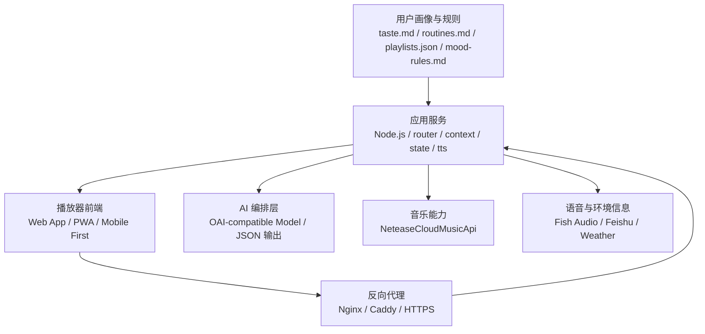

# Emily

服务器部署版个人 AI 电台 / AI DJ 播放器项目说明

> 说明：当前仓库仅包含 3 张项目截图。本文档一方面整理截图中能确认的产品与架构信息，另一方面合并当前已确认的第一版开发决策。当截图设想与当前计划冲突时，以“第一版范围”和“部署与访问方式”章节为准。

## 项目简介

Emily 是一个围绕“个性化音乐陪伴”构建的 AI 电台系统。它不只是一个播放器，而是一个能够理解用户口味、结合环境信息、自动挑选音乐并生成串场语音的 AI DJ。

项目的核心目标，是把以下几类信息整合到一次完整的听歌体验中：

- 用户长期口味与收藏歌单
- 用户当下情境，例如时间、天气、日程和状态
- 音乐检索、推荐与播放能力
- 语音合成与 AI 主持词生成能力
- Web / PWA 播放器与服务端协同能力

最终呈现出来的效果，是一个会“播歌 + 说话 + 解释为什么播这首歌”的私人电台。

## 第一版范围

当前已经确认的第一版范围如下：

- 项目名称确定为 `Emily`
- 部署目标是公网服务器，而不是仅在本地运行
- 前端形态优先选择 `Web App`，并保留升级为 `PWA` 的空间
- 用户通过浏览器访问子域名使用系统，例如 `https://emily.example.com`
- 前端与后端采用同域部署，对外 API 路径使用 `/api/*`
- 实时状态同步使用 `WebSocket`，路径建议为 `/stream`
- 正式环境使用 `HTTPS`
- 第一版暂不做家庭音响控制，也不做 `UPnP`
- 第一版音频直接在浏览器中播放

## 产品定位

Emily 更适合被理解为一个“个人 AI 电台”系统，而不是传统意义上的音乐播放器。

与普通播放器相比，它强调：

- 从“点播”转向“编排”：不仅播放歌曲，还决定播放顺序与上下文
- 从“推荐算法”转向“可解释陪伴”：不仅推荐音乐，还给出语言化的过渡和理由
- 从“单一播放”转向“AI 主持体验”：让音乐、串场文案、语音播报形成连续节目感

## 核心体验

- 根据用户口味与历史歌单，自动挑选适合当前场景的歌曲
- 结合天气、时间、日程等信息，为音乐选择生成语义上的理由
- 通过 TTS 生成类似电台主持人的串场语音
- 在 Web / PWA 播放器中展示当前歌曲、AI 文案和时间轴
- 在手机或电脑浏览器中直接播放音频

## 第一版系统总览

从截图和当前规划综合来看，Emily 第一版可以归纳为三层：

1. 播放器前端
2. Node.js 应用服务
3. 多个外部 API / 能力服务

其中：

- 播放器前端负责展示与交互
- Node.js 应用服务负责调度、拼装上下文、调用模型和执行动作
- 外部 API 负责提供音乐、语音、天气、日程等能力

与截图中“本地服务器”的表达不同，当前第一版计划将这套服务部署到服务器上，对外提供统一的 HTTPS 访问入口。

## 部署与访问方式

第一版推荐采用“单子域名、同域前后端”的部署方案：

- 前端入口：`https://emily.example.com`
- 后端 API：`https://emily.example.com/api/*`
- 实时连接：`wss://emily.example.com/stream`

推荐部署形态：

- `Nginx` 或 `Caddy` 作为反向代理和 HTTPS 终止层
- 前端静态资源由反向代理直接分发
- Node.js 服务运行在内网端口，例如 `127.0.0.1:3000`
- `/api/*` 和 `/stream` 由反向代理转发给 Node.js

这样做的好处：

- 前后端同域，避免第一版就处理复杂的 `CORS`
- 部署结构清晰，适合快速迭代
- 浏览器、手机和平板都能直接访问
- 方便后续升级为 PWA

协议建议：

- 本地开发环境：`http://localhost`
- 正式环境：`https://emily.example.com`

## 架构图



## 模块拆解

### 1. Player / Web App / PWA

前端播放器是用户直接接触的界面，截图中表现为移动端风格的卡片式播放器。

第一版主要职责：

- 展示当前播放歌曲、艺人、进度、波形等信息
- 展示 AI 串场文案或实时字幕
- 提供播放、暂停、切歌等交互
- 通过 HTTP 或 WebSocket 与后端同步状态

当前建议：

- 首先实现 `Web App`
- 设计上移动端优先
- 后续再补 `PWA` 能力

### 2. Server / Node.js

Node.js 服务是整个系统的编排中心。

主要职责：

- 接收来自前端或定时任务的触发
- 组装用户画像、环境信息、历史记录和系统提示词
- 调用通用模型接口获取结构化决策结果
- 按决策调用音乐、TTS、天气、日程等服务
- 维护当前状态与记忆

它在整个系统中相当于“导演台”或“中控台”。

### 3. BRAIN / OAI Model Gateway

模型编排层在系统中承担“大脑”角色，负责理解上下文并给出高层决策。第一版不直接绑定具体模型供应商，而是通过 OAI-compatible HTTP API 调用模型。

从截图可推断，它的输出不是直接给用户看的自然语言，而更像是结构化结果，例如：

- 是否要讲话
- 说什么
- 播放哪首歌
- 是否需要切换队列
- 是否需要执行某个序列动作

截图里可见的输出字段包括：

- `say`
- `play[]`
- `reason`
- `segue`

这意味着模型更像“节目编排器”，而不仅是文案生成器。业务层只依赖模型网关抽象，后续可以替换为 OpenAI、兼容 OpenAI 协议的网关或本地模型服务。

### 4. MUSIC / 网易云音乐

音乐能力主要由 `NeteaseCloudMusicApi` 提供。

截图中可见的能力包括：

- `search`
- `song_url`
- `lyric`
- `recommend`

因此它至少承担：

- 检索歌曲
- 获取可播放链接
- 获取歌词
- 提供推荐候选

### 5. VOICE / I-O

语音与外部输入输出能力由多个服务组成。

截图中明确出现：

- Fish Audio：语音合成
- Feishu：读取日程或外部信息
- Weather / OpenWeather：天气信息

在当前第一版中，这些能力主要用于“环境理解 + 串场语音生成”，不包含家庭音响投放。

### 6. 用户画像与规则

截图中的用户侧配置非常关键，说明这个项目并不是完全依赖在线推荐，而是强调“长期可配置的个性化”。

已出现的文件包括：

- `taste.md`
- `routines.md`
- `playlists.json`
- `mood-rules.md`

这些文件大致对应：

- 音乐口味偏好
- 日常作息与习惯
- 用户自己的歌单数据
- 情绪或场景到音乐风格的映射规则

### 7. 中控模块

截图中出现了一组明显的后端模块：

- `router.js`
- `context.js`
- `model.js`
- `scheduler.js`
- `tts.js`
- `state.js`

根据命名可推断其职责如下：

#### `router.js`

负责意图分流与动作编排，例如决定是先播音乐、先说话，还是同时准备下一首。

#### `context.js`

负责拼接系统提示、用户画像、环境信息、历史状态和本轮输入，生成发送给模型的最终上下文。

#### `model.js`

负责和 OAI-compatible 模型接口交互，将上下文发送给模型并接收结构化响应。

#### `scheduler.js`

负责基于时间的触发，例如早晚固定栏目、整点播报和定时编排任务。

#### `tts.js`

负责将 AI 文案转换为音频文件，并接入后续播放流水线。

#### `state.js`

负责维护运行状态与记忆，例如消息历史、播放历史、计划、偏好和队列。

## 上下文构成

截图中提到一个 `CONTEXT WINDOW`，会在每次触发时拼装若干块信息后再发给模型。可归纳为以下几类：

- 系统提示词：如 DJ 风格、节目规则、输出格式
- 用户语料：如口味、歌单、偏好规则
- 历史记忆：最近播放记录、最近说过的话、当前状态
- 用户输入 / 工具结果：例如搜索结果、播放状态、事件结果
- 环境注入：天气、日历、当前时间等
- 执行轨迹：定时器、webhook 或其他触发来源

这一设计说明项目的关键不在单次问答，而在“多来源上下文拼装 + 稳定结构化输出”。

## 典型工作流

一个典型的第一版运行流程可以描述为：

1. 用户在浏览器中打开 `https://emily.example.com`
2. 前端请求 `/api/now` 获取当前状态
3. Node.js 服务读取用户画像、当前状态和环境信息
4. `context.js` 组装本轮 prompt
5. `model.js` 调用 OAI-compatible 模型接口，获取结构化决策
6. `router.js` 解析决策并分发执行
7. 音乐服务获取歌曲链接、歌词或推荐结果
8. `tts.js` 将主持词转为音频
9. 浏览器前端播放音乐，并展示 AI 文案与实时状态
10. `state.js` 记录本轮结果，为下一轮生成提供记忆

## 接口约定

从截图中能识别出的接口形式，已经比较接近第一版所需的 HTTP / WebSocket 协议层。

已能识别出的接口包括：

- `GET /api/now`
- `GET /api/taste`
- `GET /api/plan/today`
- `WS /stream`

结合当前部署决策，建议它们对外统一挂在同一子域名下：

- `https://emily.example.com/api/now`
- `https://emily.example.com/api/taste`
- `https://emily.example.com/api/plan/today`
- `wss://emily.example.com/stream`

从命名推测：

- `/api/now`：返回当前播放与当前节目状态
- `/api/taste`：返回用户偏好或画像数据
- `/api/plan/today`：返回当天计划、节目安排或日程上下文
- `/stream`：推送实时状态，例如当前句子、播放进度和队列变化

## 技术栈

根据截图和当前规划，可以明确或高概率判断出的技术栈如下：

- 前端：Web App，后续可扩展为 PWA
- 后端：Node.js
- 模型层：OAI-compatible Model Gateway
- 音乐能力：NeteaseCloudMusicApi
- 语音能力：Fish Audio
- 环境能力：Weather / OpenWeather
- 外部信息接入：Feishu API
- 网关层：Nginx 或 Caddy
- 传输协议：HTTPS + WSS

## 建议的仓库结构

如果后续要把这个仓库补全为可维护的工程，建议按职责拆成下面的结构：

```text
.
├─ README.md
├─ docs/
│  ├─ architecture.md
│  ├─ api.md
│  └─ deployment.md
├─ user/
│  ├─ taste.md
│  ├─ routines.md
│  ├─ playlists.json
│  └─ mood-rules.md
├─ prompts/
│  ├─ dj-persona.md
│  └─ output-schema.md
├─ state/
│  └─ state.db or state.json
├─ server/
│  ├─ router.js
│  ├─ context.js
│  ├─ model.js
│  ├─ scheduler.js
│  ├─ tts.js
│  └─ state.js
├─ integrations/
│  ├─ music/
│  ├─ voice/
│  ├─ weather/
│  └─ calendar/
├─ web/
│  ├─ src/
│  └─ public/
└─ deploy/
   └─ nginx/
```

## 当前仓库状态

目前仓库中可见内容只有三张截图：

- `PixPin_2026-04-23_14-41-44.png`
- `PixPin_2026-04-23_14-42-09.png`
- `PixPin_2026-04-23_14-44-06.png`

这意味着当前文档属于“项目说明 + 第一版方向确认版 README”，适合用于：

- 对外介绍项目概念
- 统一团队对第一版架构的理解
- 为后续补全源码、接口和部署文档提供基线

不适合直接作为：

- 完整上线手册
- 真实 API 文档
- 精确的代码结构说明

## 后续建议

为了让 Emily 从概念走向可运行工程，建议下一步优先补齐以下内容：

1. 明确 OAI-compatible 模型接口的输入输出协议，固定 JSON schema
2. 明确前端与后端之间的接口契约
3. 明确浏览器播放链路，确认音频源、歌词和 TTS 的时序
4. 把用户画像、规则和状态存储落实为真实目录结构
5. 增补 `deployment.md`，固化 `Nginx + HTTPS + Node.js` 的上线方案
6. 为编排流程补一份时序图，明确“说话”和“播歌”的调度关系

## 项目截图

### 整体结构图


### 模块施工图


### 成品体验图


## 一句话定义

Emily 是一个部署在服务器上、通过 HTTPS 子域名访问、以前端 Web / PWA 为入口、以 Node.js 为中枢、以 OAI-compatible 模型接口为编排大脑的个人 AI 电台系统。
